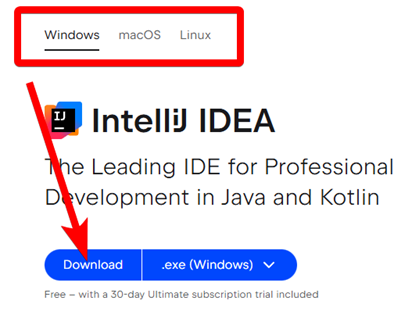
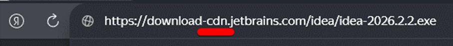
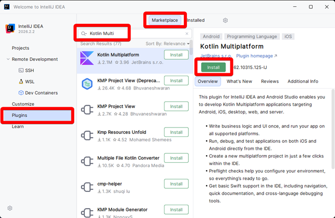
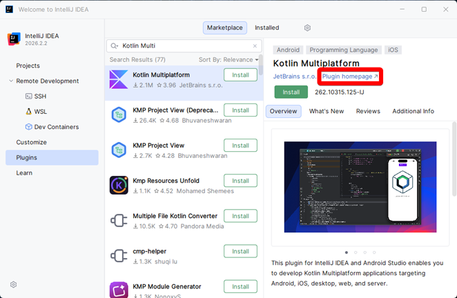
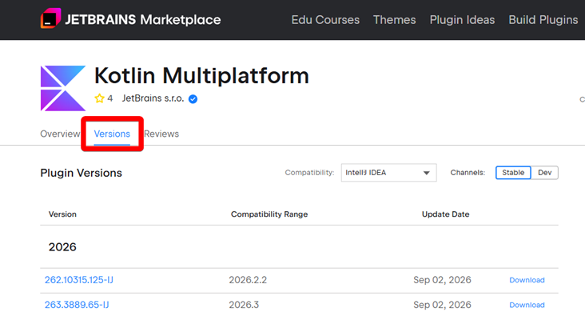
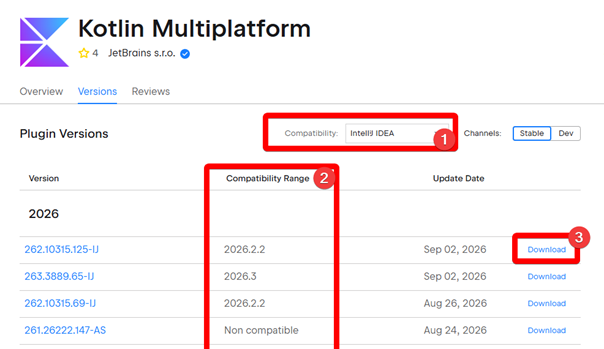
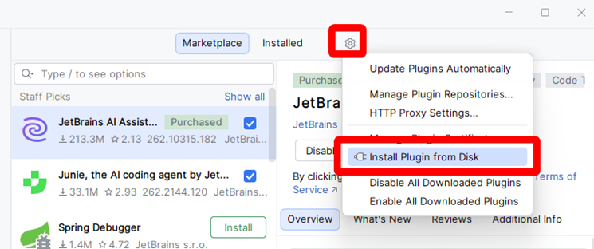

# Лабораторная работа 1: Установка и настройка окружения

> **IDE** (от англ. Integrated Development Environment) — это интегрированная среда 
> разработки, специальная программа для написания, тестирования и запуска кода.

> **SDK** (от англ. Software Development Kit) — это комплект средств для разработки 
> программного обеспечения, который помогает создавать приложения под конкретную 
> платформу, операционную систему или сервис.

> **Kotlin** — это кроссплатформенный и статически типизированный язык программирования 
> общего назначения, который работает поверх виртуальной машины Java (JVM) и создан 
> компанией **JetBrains**.

> **Kotlin Multiplatform** (KMP) — это SDK от компании **JetBrains**, который используется
> для создания кроссплатформенных приложений на языке **Kotlin**.

## Выбор и установка IDE

**Kotlin Multiplatform** полностью поддерживается в **IntelliJ IDEA** и **Android Studio**. 
Для работы с плагинами, необходимыми для Kotlin Multiplatform, требуется как минимум 
**IntelliJ IDEA** версии 2025.2.2 или **Android Studio** версии Otter 2025.2.1.

Разберём процесс скачивания и установки **IntelliJ IDEA**.

### Шаг 1

Перейдите по ссылке: https://www.jetbrains.com/idea/download.

Выберите вашу платформу и нажмите **Download**.

### Шаг 2

Если установочный файл скачался и **не появилась** ошибка 451, переходите к [Шагу 3](#Шаг-3).

Если ошибка 451 появилась, нажмите на адресную строку и добавьте `-cdn` после `download`.

### Шаг 3

Запустите скачанный установочный файл.

### Шаг 4

Везде нужно нажать **Next >**, и затем **Install**. Ждать пока установка завершится 
и нажать **Finish**.

### Шаг 5

Запустите **IntelliJ IDEA**.

> Для работы с **Kotlin** и **Java** платная подписка **Ultimate** не нужна.

## Настройка IDE и плагинов

Для работы с **KMP**, необходимо установить плагин **Kotlin Multiplatform**. 

### Шаг 1

Перейдите в раздел **Plugins**, во вкладку **Marketplace**, в поиске напишите 
`Kotlin Multiplatform` и нажмите **Install**.

Если плагин установился, и не появилось ошибок, приступайте к [Практическому заданию](#Практическое-задание).

### Шаг 2

Если появилась ошибка при установке плагина, нажмите **Plugin homepage**.

### Шаг 3

Перейдите во вкладку **Versions**.

### Шаг 4

1) Выберите **IDE**.
2) Выберите версию вышей **IDE**.
3) Нажмите **Download**.

### Шаг 5

Должны получить страницу с ошибкой 451. Откройте адресную строку, и 
замените `plugins.jetbrains.com` на `downloads.marketplace.jetbrains.com`:

Становится:

Теперь можно установить плагин из файла формата `.zip`.

### Шаг 6

Вернитесь в **IntelliJ IDEA**, нажмите на **шестерёнку** -> **Install plugin from disk**.

Выберите файл плагина, который скачали в предыдущем шаге.

### Шаг 7

Плагин должен быть установлен и появиться во вкладке **Installed**. 
Нажмите **Restart IDE**, чтобы перезапустить **IDE**.

## Практическое задание

Проверьте наличие установленных плагинов:

- `Kotlin Toolchain`
- `Android Design Tools`
- `Native Debugging Support`
- `Compose Multiplatform`
- `Java`
- `Kotlin`
- `Android`
- `Exposed`
- `Jetpack Compose`

Самостоятельно установите недостающие плагины, пользуясь разделом 
[Настройка IDE и плагинов](#Настройка-ide-и-плагинов).