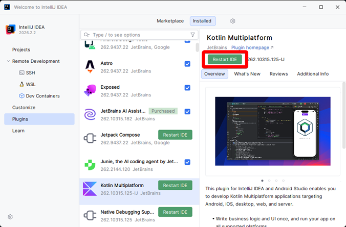

# Настройка IDE и плагинов

Для работы с **KMP**, необходимо установить плагин **Kotlin Multiplatform**.

## Шаг 1: Поиск Kotlin Multiplatform

Перейдите в раздел **Plugins**, во вкладку **Marketplace**, в поиске напишите
`Kotlin Multiplatform` и нажмите **Install**.

Если плагин установился, и не появилось ошибок, приступайте к [Практическому заданию](lab1/practice.md).

## Шаг 2: Ошибка при скачивании

Если появилась ошибка при установке плагина, нажмите **Plugin homepage**.

## Шаг 3: Выбор версии и IDE

Перейдите во вкладку **Versions**.

1) Выберите **IDE**.
2) Выберите версию вышей **IDE**.
3) Нажмите **Download**.

## Шаг 4: Ошибка 451

Должны получить страницу с ошибкой 451. Откройте адресную строку, и
замените `plugins.jetbrains.com` на `downloads.marketplace.jetbrains.com`:

Становится:

Теперь можно установить плагин из файла формата `.zip`.

## Шаг 5: Установка из файла

Вернитесь в **IntelliJ IDEA**, нажмите на **шестерёнку** -> **Install plugin from disk**.

Выберите файл плагина, который скачали в предыдущем шаге.

## Шаг 6: Перезапуск IDE

Плагин должен быть установлен и появиться во вкладке **Installed**.
Нажмите **Restart IDE**, чтобы перезапустить **IDE**.

